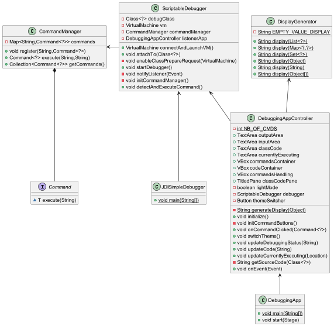
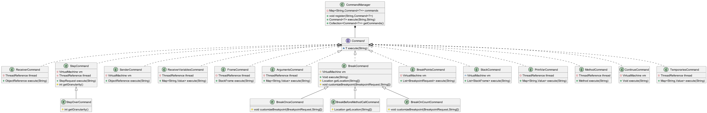
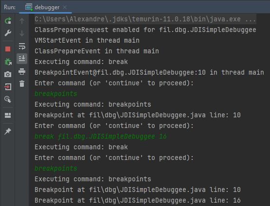
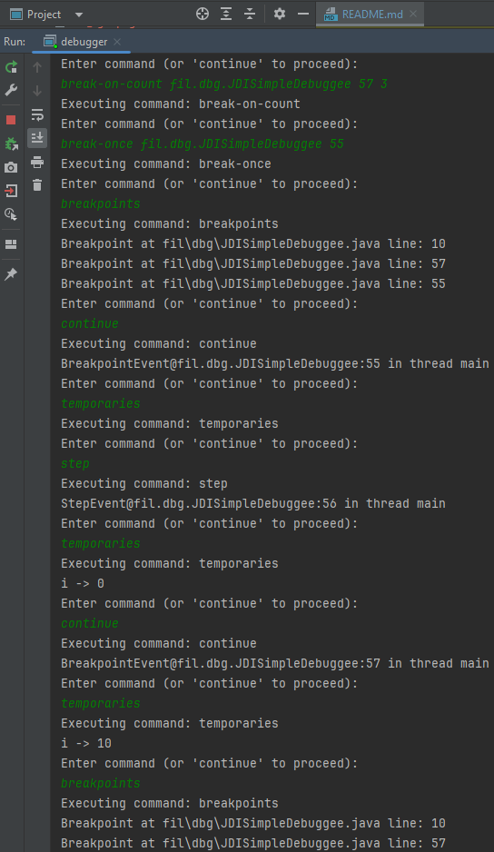
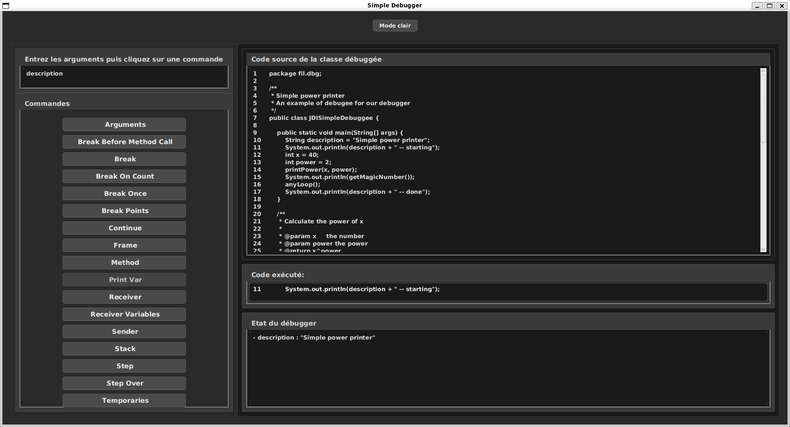
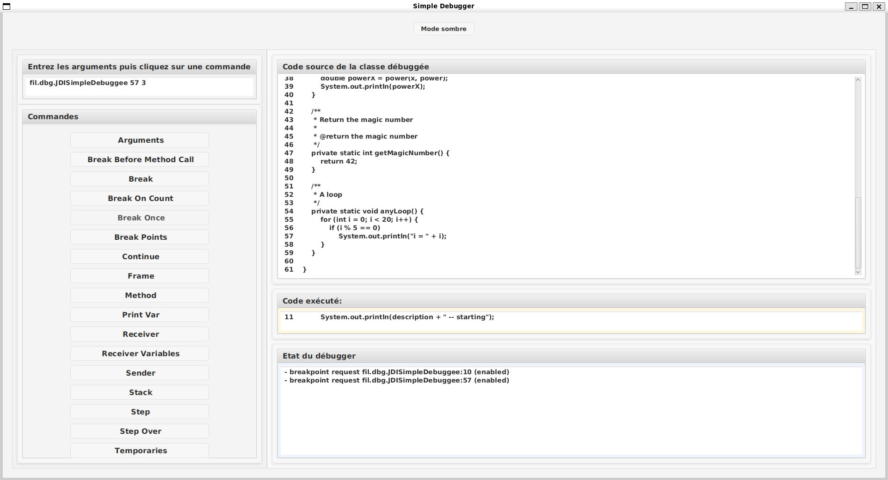

# Rapport sur le debugger

## Membres

    - Alexandre Ledun
    - Jeanne Lauwers

## Introduction

L'objectif de ce projet est d'implémenter un debugger simplifié, contrôlable manuellement via une interface textuelle,
en utilisant Java Debug Interface. Cette réalisation s'appuie sur l'environnement de développement IntelliJ,
bien qu'elle puisse également être effectuée avec Eclipse.

## Lancement du projet

* Cloner

### Avertissement

* IntelliJ et Maven ne compilant pas les fichiers .java selon la même hiérarchie de dossiers, il est possible que 
l'exécution d'une commande `mvn clean` après avoir d'abord exécuté le projet sur IntelliJ provoque une erreur. On
recommande donc, même si vous voulez commencer par lancer le projet en ligne de commande, de réaliser la commande
`mvn clean package` avant de configurer le projet pour IntelliJ. Suite à quoi vous pourrez exécuter le projet avec un
simple `mvn exec:exec`.

### Lancement *via* IntelliJ (**LIGNE DE COMMANDE**)

* Configurer le "Working Directory" sur le répertoire contenant les fichiers .class générés (`.\target\classes`).

* Configurer l'exécution du main sur la classe `fil.dbg.JDISimpleDebugger`.

* Si besoin : exécuter au préalable `mvn clean package` pour générer les fichiers .class des ressources 
nécessaires avant d'exécuter le projet sur IntelliJ.

### Lancement *via* le projet Maven (**INTERFACE GRAPHIQUE**)

* Depuis le dossier racine du projet, entrez en ligne de commande `mvn clean package exec:exec`.

* Attention : **PAS** `mvn exec:java` car le projet utilise des fichiers de ressources JavaFX.

* Le `pom.xml` a été configuré pour exécuter le main sur la classe `fil.ui.app.DebuggingApp`.

## Utilisation du projet

- Dans les deux cas, l'exécution du projet initialise le ScriptableDebugger avec la classe JDISimpleDebuggee passée en 
paramètre; dès le lancement, le debugger se connecte à la VM, place un point d'arrêt sur la première ligne du main de 
la classe débuggée, et attend une commande de l'utilisateur en atteignant ce point d'arrêt. 

- A noter que certaines commandes ne provoquent aucun affichage, selon les spécifications (par exemple `receiver` et
`sender`). Ces commandes ne provoqueront un affichage qu'en cas d'erreur.

- A noter également que contrairement au débogueur d'un IDE classique, le debugger ne permet pas d'accéder au code 
source autre que celui de la classe débuggée. Par exemple, si la classe débuggée appelle une méthode d'une autre classe,
qu'elle soit une autre classe du projet débuggé ou une classe de la bibliothèque standard, le debugger ne pourra pas 
accéder au code source de cette méthode (que ça soit pour y placer un point d'arrêt, ou pour l'afficher dans le cas 
du GUI). Cela est dû au chargement dynamique des classes par la JVM.

- Vous trouverez des captures d'écran de chaque mode d'utilisation à la fin de ce rapport (sous-section [Captures d'écran](#screenshots)).

### Ligne de commande

- Une fois le `breakpoint` atteint, un affichage `Enter command (or 'continue' to proceed)` apparaît. L'utilisateur peut 
alors taper une commande dans le terminal pour contrôler le debugger. Les commandes disponibles et leur effet sont 
décrits dans le fichier [list_commandes.md](./doc/list_commandes.md).

- A noter que les commandes sont sensibles à la casse et doivent être tapées en  minuscules, avec un tiret `-` pour 
séparer les mots (par exemple `step-over`) et un espace entre les arguments (par exemple `print-var description`).

- Si une commande n'est pas reconnue ou provoque une erreur, le debugger affiche un message d'erreur et attend une
nouvelle commande.

- Certaines commandes prennent un ou plusieurs arguments en paramètre. Les arguments sont séparés par des espaces.
Si les arguments fournis sont insuffisants ou invalides, l'exécution provoquera une erreur et le debugger attendra une
nouvelle commande. Si un argument est un nom de classe, il doit être fourni sous la forme `nom.des.packages.NomClasse`.
  - Exemple pour placer un point d'arrêt à la ligne 10 de `JDISimpleDebuggee` : `break fil.dbg.JDISimpleDebuggee 10`.

### Interface graphique (GUI)

- Une fois le `breakpoint` atteint, l'utilisateur peut utiliser l'interface graphique pour contrôler le debugger. Un
panneau affiche la ligne du code source en cours d'exécution, un autre affiche des informations renvoyées par 
l'exécution de la dernière commande sélectionnée : par exemple, les variables locales après l'exécution de la commande
`temporaries`, ou un message d'erreur si la commande a échoué.

- Lorsque la VM est en pause, l'utilisateur peut cliquer sur un bouton pour exécuter une commande. Il est alors 
possible, par exemple, de visualiser l'ensemble du contexte à chaque *step* à l'aide des différentes commandes :
`Frame`, `Stack`, `Temporaries`, etc. Il est également possible d'afficher la liste des points d'arrêt actifs et leurs 
propriétés avec la commande `Breakpoints`. 

- L'utilisateur peut exécuter n'importe quelle commande en cliquant sur le bouton correspondant. Si la commande prend 
des arguments, l'utilisateur peut les entrer dans un champ de texte **avant** de cliquer sur le bouton correspondant. 
Si les arguments fournis sont insuffisants ou invalides, la commande n'est pas exécutée et un message d'erreur est 
affiché. Comme en ligne de commande, si un argument est un nom de classe, il doit être fourni sous la forme 
`nom.des.packages.NomClasse`, et les arguments sont séparés par des espaces.

- A tout instant, le code source est affiché en entier dans un panneau, et un panneau séparé précise quelle ligne est en
cours d'exécution; à noter cependant que, comme mentionné plus haut, le code source peut ne pas être disponible, 
notamment si le code exécuté n'est pas présent dans le code source de la classe débuggée. 

## Conception du Debugger

### Architecture du Debugger :

#### UML de classes (architecture générale)

[](./doc/UML_global_arch.png)

#### UML de classes (commandes)

[](./doc/UML_commands.png)

La classe `ScriptableDebugger` est responsable de la coordination de toutes les opérations de débogage. Elle permet de :

- se connecter à une VM Java.
- gérer les commandes de débogage à l'aide du CommandManager.
- gérer les événements de débogages.

Pour gérer les commandes, nous avons utilisé le *design pattern* `Command` comme conseillé dans le sujet.
On a donc une interface `Command<?>` générique qui représente une commande de débogage, associé à son type de retour. 
Chaque type de commande implémente cette interface et définit sa méthode `execute()`. La méthode `execute()` prend en 
paramètre un nombre indéfini d'arguments de type `String`, qui peuvent être utilisés pour paramétrer la commande quand 
c'est pertinent. Par exemple, la commande `break` prend en paramètre le nom de la classe et le numéro de ligne où 
placer le point d'arrêt.

Certaines commandes héritent d'une autre classe de commande de base. Par exemple, `BreakOnceCommand` et
`BreakOnCountCommand` héritent de `BreakCommand`. Cette dernière définit une méthode `execute()` qui permet de placer un
point d'arrêt sur une ligne de code, et appelle une méthode `customizeBreakpoint()` avant d'activer la requête. Cette 
méthode n'a aucun effet par défaut dans la classe `BreakCommand`, mais elle est réimplémentée par les classes filles 
pour ajouter des fonctionnalités spécifiques. Par exemple, `BreakOnCountCommand` permet de placer un point d'arrêt sur 
une ligne de code et de spécifier le nombre de fois que le point d'arrêt doit être atteint avant de s'activer grâce à 
la méthode `addCountFilter()` du `BreakpointRequest`.

De plus, nous avons créé une classe `CommandManager` qui gère ces commandes. Elle permet d'enregistrer et d'exécuter 
les bonnes commandes en fonction de ce que l'utilisateur tape dans le terminal.

Pour l'interface graphique, nous avons créé une vue (`DebuggingAppView`) et un contrôleur (`DebuggingAppController`). 
Si l'utilisateur utilise cette interface, c'est ce *controller* qui exécute les commandes pertinentes en fonction du 
bouton cliqué par l'utilisateur, avec les éventuels paramètres entrés dans un champs de texte quand c'est pertinent.

### Choix techniques :

L'utilisation de JDI nous a permis d'interagir avec une VM Java facilement. Elle fournit un ensemble de fonctionnalités 
 complet pour accéder à des informations sur l'état de la VM et contrôler son exécution.

Nous avons une architecture modulaire qui nous permet d'étendre le debugger rapidement et facilement.
En effet, si l'on souhaite ajouter une nouvelle commande, il suffit de créer une nouvelle classe qui implémente
l'interface `Command<?>`. Cela rend le code plus maintenable et plus facile à comprendre.

Il y a deux mécanismes pour utiliser le projet : en ligne de commande et via l'interface graphique.
Cela donne de la flexibilité à l'utilisateur, qui peut choisir le mode qui lui convient le mieux.
Même si l'interface est, à notre sens, beaucoup plus agréable et pratique à utiliser. Nous avons fait un effort apporter
un confort visuel à l'interface graphique, avec un bouton pour passer d'un thème clair à un thème sombre, un affichage 
qui s'adapte en partie à la taille de la fenêtre, un bouton par commande à exécuter, etc. A noter que les styles CSS 
utilisés sont très inspirés de diverses sources en ligne, pour éviter de perdre trop de temps sur cet aspect qui 
n'était pas l'objectif du projet.

En  ce qui concerne l'interface graphique, nous avons utilisé JavaFX et avons appliqué le pattern standard MVC. Le 
modèle correspond à la classe `ScriptableDebugger`, la vue à `DebuggingAppView` et le contrôleur à 
`DebuggingAppController`. Nous avons également implémenté un *design pattern* `Observer` pour que la vue soit notifiée 
par le modèle lorsqu'un événement (par exemple un `StepEvent`) se produit.

Un choix notable a été de ne pas exécuter les commandes *via* le `CommandManager` dans le GUI. En effet, nous avons 
bien utilisé ce *manager* pour récupérer les commandes initialisées, mais nous avons considéré le panneau de commandes 
comme un *manager* en soi : au clic sur un bouton, l'objet `Command<?>` correspondant est exécuté. Cela nous a permis
de gérer l'attente de commande dans le terminal de manière indépendante de l'interface graphique. 

## Perspectives

### Le *step back*

Pour implémenter le *step back*, il serait possible de :

- Capturer l'état actuel du programme (les variables locales, la pile d'exécution, etc.) à chaque fois qu'une
  commande serait exécutée.
- Restaurer l'état précédent du programme lorsque l'utilisateur demande à revenir en arrière. Cela impliquerait de
  réinitialiser la pile d'appels, les valeurs des variables, etc.
- Exécuter l'étape précédente en revenant à l'étape précédente de code.
- Mettre à jour l'interface utilisateur pour refléter l'état restoré du programme. Il montrerait donc l'état tel qu'il 
  était avant le step back.

Dans notre projet, il serait possible de :

- Créer une classe `DebuggerState` qui contiendrait les informations nécessaires pour restaurer l'état du programme :
  - L'état de la pile d'appels
  - L'état des variables locales et globales
  - L'état des *threads*
  - L'état des objets et instances
  - Les points d'arrêt actuels
  - Les infos sur le fichier source

- Créer une commande `StepBackCommand` qui permettrait de revenir à l'état précédent du programme en suivant les étapes
ainsi décrites.

### Améliorer la récupération du code source

Actuellement, dans l'interface, pour récupérer le code source de la classe débuggée au format String, on présume du 
dossier depuis lequel l'utilisateur lance le projet. Cela fonctionne bien avec notre version de Maven, et dans les 
conditions dans lesquelles nous avons testé le projet, mais cela pourrait ne pas fonctionner dans d'autres conditions.

```java
// Extrait de la méthode getSourceCode() de DebuggingAppController
String className = someClass.getName();
String sourceFileName = className.replace('.', File.separatorChar) + ".java";
Path sourceFilePath = Paths.get("..", "..", "src", "main", "java", sourceFileName);
String sourceCode = Files.readString(sourceFilePath);
//...
```

`sourceFilePath` ne sera donc correctement récupéré qu'à deux conditions. D'abord si le répertoire courant est configuré comme un dossier imbriqué 
dans un autre dossier, lui-même étant dans le même dossier qu'un dossier `src`; puis seulement si le fichier source est présent dans
le dossier `src/main/java`. C'est le cas actuellement, mais on pourrait imaginer par exemple que si vous 
réussissez à exécuter le projet depuis un autre dossier, ou si vous utilisez un autre système de *build* que Maven, cela 
ne fonctionnera pas. On a donc une dépendance à la structure du projet. Cependant, il est possible de modifier le code 
pour que cela fonctionne dans d'autres conditions; un affichage est effectué dans la console si le fichier source n'est
pas trouvé, informant l'utilisateur qu'il peut alors modifier la méthode `getSourceCode()` pour qu'elle fonctionne dans 
son cas. Ce n'est pas idéal, mais cela n'est pas bloquant : le debugger fonctionne même si le fichier source n'est pas 
trouvé, et nous fournissons l'information à l'utilisateur pour qu'il effectue les modifications nécessaires.

On pourrait cependant imaginer une solution plus robuste, par exemple en demandant à l'utilisateur de spécifier le 
chemin vers le fichier source *via* un champ de texte dans l'interface graphique.

## *Screenshots*

### Exemples d'utilisation avec ligne de commande (exécution depuis IntelliJ)

[](./doc/command_line_trace_1.png)
[](./doc/command_line_trace_2.png)

### Exemples d'utilisation avec GUI (exécution en tant que projet Maven)

[](./doc/GUI.png)
[](./doc/GUI_light.png)
